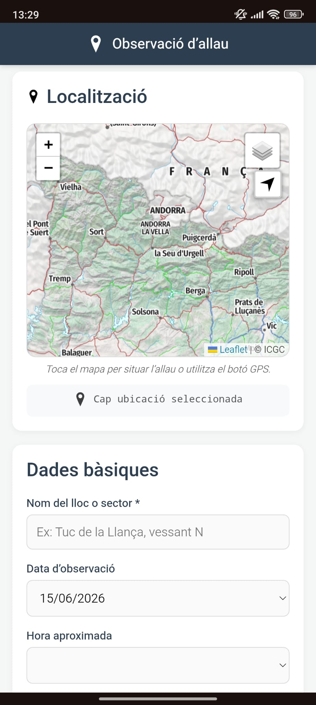
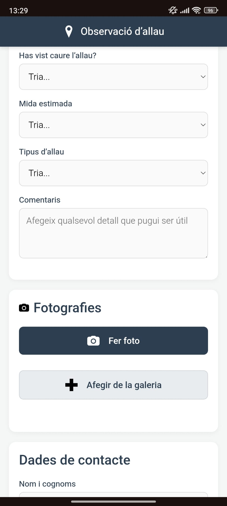
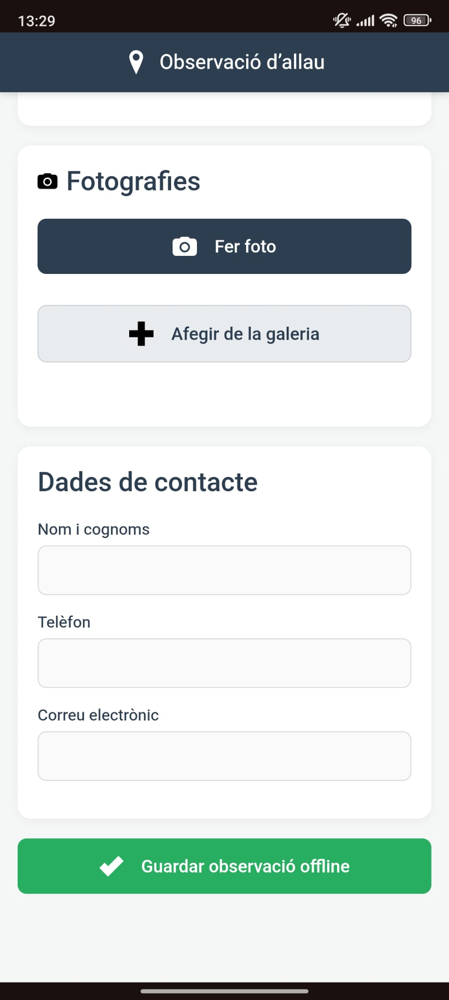
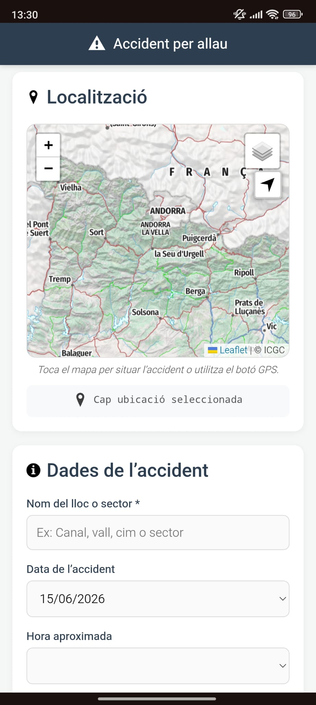
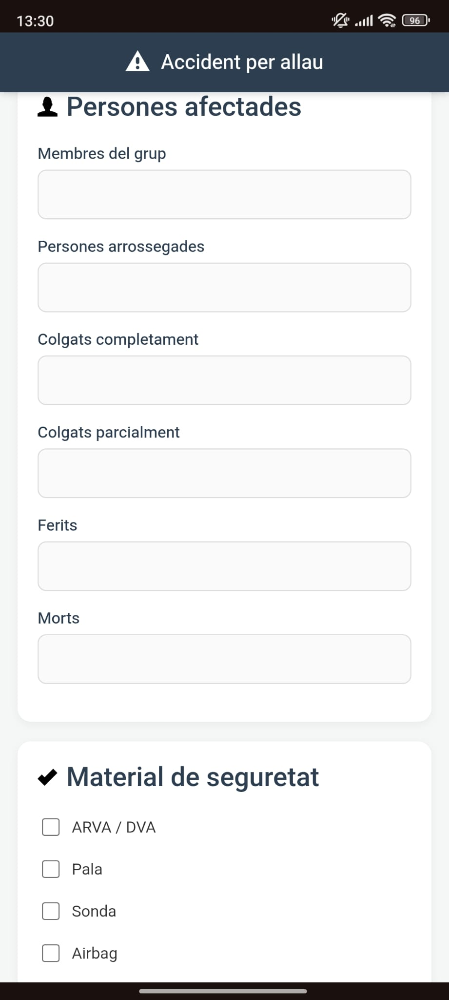
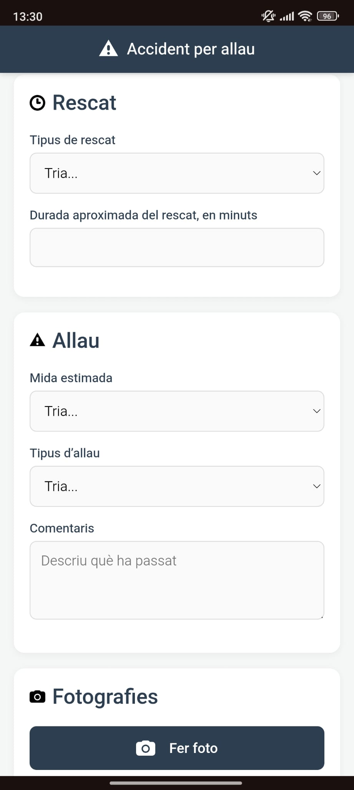
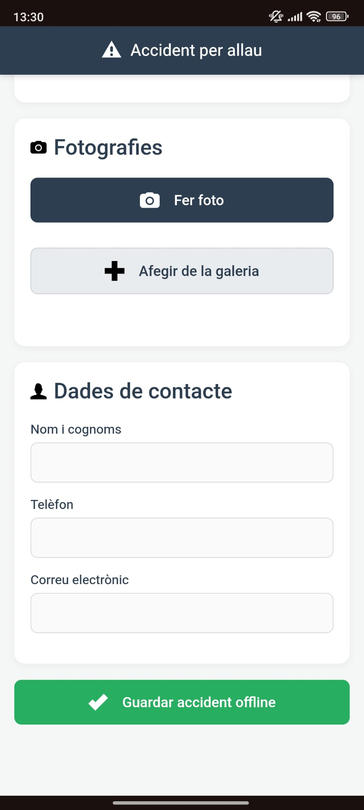
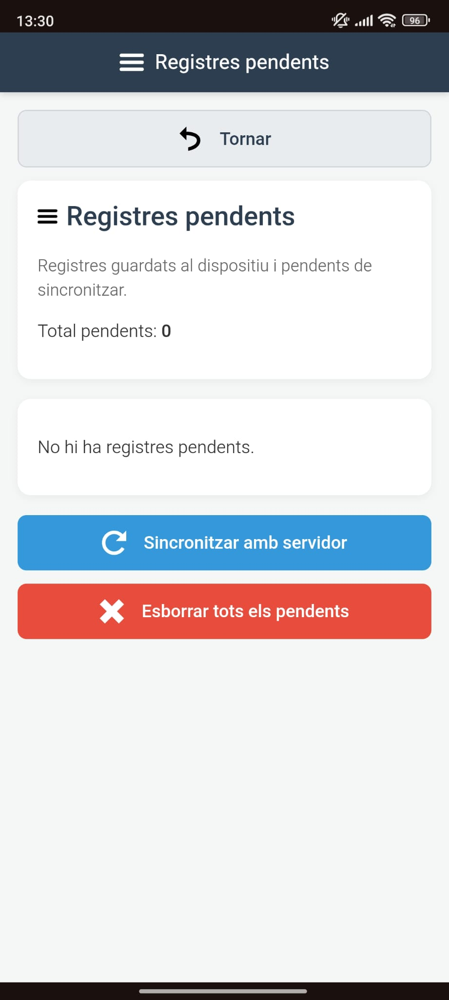
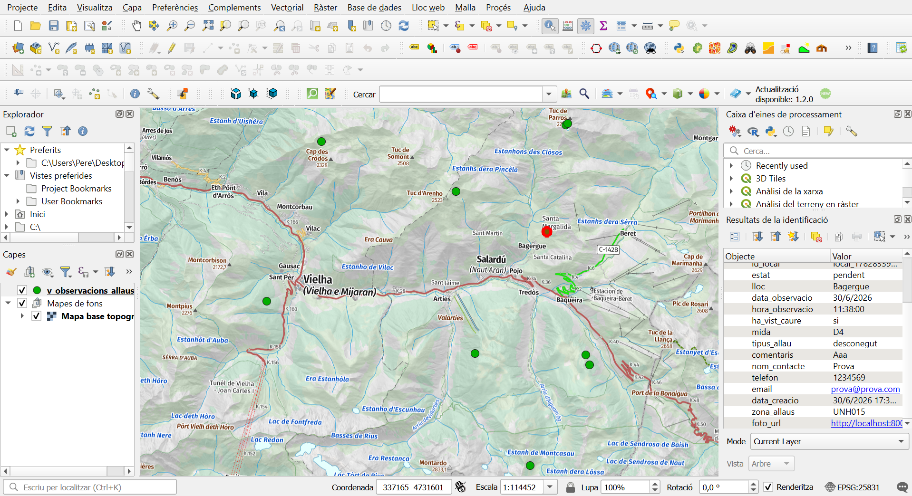

# Avalanche Field GIS

Mobile geospatial system for collecting, synchronizing and validating avalanche observations and accidents.

Developed as my Master's Thesis in Geoinformation at the Universitat Autònoma de Barcelona in collaboration with the Avalanche Forecasting and Snow Science Unit of the Institut Cartogràfic i Geològic de Catalunya (ICGC).

---

## Overview

Avalanche forecasting agencies receive valuable field observations from technicians, mountain users and rescue teams. However, this information frequently arrives through different channels (emails, messaging applications, phone calls or photographs), making validation and mapping slow and inefficient.

This project redesigns that workflow by providing a complete geospatial system that enables structured data collection directly in the field and seamless integration with GIS production environments.

The solution combines:

- Mobile Web Application (PWA)
- Offline data collection
- FastAPI backend
- PostgreSQL/PostGIS database
- QGIS integration

---

## Motivation

During my internship at the Avalanche Forecasting and Snow Science Unit (ICGC), I identified several limitations in the existing workflow:

- Information arrived through multiple communication channels.
- Photos and locations were frequently separated.
- GPS metadata could be lost when images were shared.
- Avalanche locations had to be interpreted manually.
- Validation required considerable GIS work before mapping.

The objective of this project was not to automate avalanche mapping, but to improve the first stage of the workflow by centralizing, structuring and geolocating field observations.

---

# System Architecture

```
Field User
      │
      ▼
Progressive Web Application
      │
Offline Storage (IndexedDB)
      │
Synchronization
      ▼
FastAPI Backend
      │
      ▼
PostgreSQL + PostGIS
      │
      ▼
QGIS
      │
Avalanche Validation & Mapping
```

---

# Main Features

## Mobile-friendly interface

Designed for smartphones and tablets.

Users can:

- Report avalanche observations
- Report avalanche accidents
- Attach photographs
- Capture GPS location
- Select locations manually on a map

---

## Interactive GIS map

The application includes:

- Topographic basemap
- Orthophoto basemap
- GPS positioning
- Manual point selection
- Layer switching

Built using **Leaflet** and official cartographic services.

---

## Offline-first workflow

One of the main objectives was allowing data collection without mobile coverage.

Features include:

- Local storage using IndexedDB
- Pending records manager
- Automatic synchronization
- Optimistic synchronization strategy
- Duplicate prevention

---

## Backend API

Developed with **FastAPI**.

Responsibilities include:

- Receiving observations
- Processing photographs
- Saving uploaded files
- Managing synchronization
- Communicating with PostgreSQL/PostGIS

---

## Spatial Database

The system stores data in PostgreSQL/PostGIS.

The database includes:

- Avalanche observations
- Avalanche accidents
- Uploaded photographs
- Avalanche zones
- Validated avalanche polygons

Spatial operations automatically assign each observation to its corresponding avalanche zone.

---

## QGIS Integration

Technicians can directly connect QGIS to the database and:

- Display submitted observations
- Open associated photographs
- Review submitted information
- Digitize avalanche polygons
- Validate field reports

This removes the need for manual data transfer.

---

# Technologies

## GIS

- QGIS
- PostGIS
- Leaflet
- GeoJSON
- WMTS
- Spatial SQL

## Backend

- FastAPI
- Python

## Frontend

- HTML5
- CSS3
- JavaScript (Vanilla)

## Database

- PostgreSQL
- PostGIS
- IndexedDB
- LocalForage

## Mobile

- Progressive Web App (PWA)
- Apache Cordova (prototype)

## Development

- Git
- GitHub

---

# Database Design

The spatial model separates:

- Avalanche observations
- Avalanche accidents
- Uploaded photographs
- Avalanche inventory
- Avalanche zones

Each submitted observation is automatically enriched through spatial intersection with the avalanche zone layer.

---

# Workflow

1. User reports an observation.
2. GPS coordinates are captured.
3. Photos are attached.
4. Record is stored locally.
5. Data are synchronized.
6. Backend processes images.
7. Observation is stored in PostGIS.
8. Avalanche zone is automatically assigned.
9. Data become immediately available in QGIS.
10. Technicians validate and digitize the avalanche.

---

# Skills Demonstrated

This project demonstrates experience in:

- GIS Application Development
- Web GIS
- Mobile GIS
- Spatial Databases
- PostgreSQL/PostGIS
- FastAPI
- JavaScript
- Leaflet
- QGIS
- Python
- REST APIs
- Spatial SQL
- Offline-first applications
- Cartography
- UX Design
- Database Design
- Geospatial Workflows

---

# Future Improvements

Potential future developments include:

- User authentication
- Multi-user synchronization
- Cloud deployment
- Push notifications
- Polygon digitization from the mobile device
- Automatic GIS validation
- GeoPackage export
- Machine Learning support for avalanche classification

---

# Academic Context

Master's Thesis

**Design and implementation of a mobile geospatial system for managing avalanche observations and accidents**

Master in Geoinformation

Universitat Autònoma de Barcelona

Developed in collaboration with:

**Institut Cartogràfic i Geològic de Catalunya (ICGC)**

Avalanche Forecasting and Snow Science Unit

---

# Screenshots

## Home Screen


---

## Avalanche Observation Form





---

## Accident Form






---

## Pending Records



---

## QGIS Integration



---

# Author

## Pere Llorens

Geographer | Master's Degree in Geoinformation

GIS • Cartography • Spatial Analysis • Spatial Databases • Web GIS • Mobile GIS • JavaScript • Python • PostGIS • QGIS

**LinkedIn:**  
https://www.linkedin.com/in/perellorenslluis/

**GitHub:**  
https://github.com/pere347

---

# Disclaimer

This repository contains the software developed as part of my Master's Thesis.

The application has been developed independently from scratch.

No confidential information, proprietary code or internal databases from the Institut Cartogràfic i Geològic de Catalunya (ICGC) are included.

Public cartographic services and publicly available spatial layers are used where applicable.